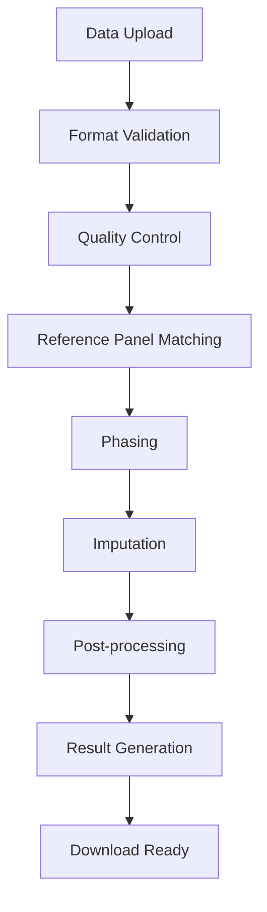

# Pipeline Overview

This page provides a detailed overview of our genotype imputation pipeline, from data upload to final results.

## Pipeline Architecture

Our imputation pipeline is built on cloud infrastructure and uses state-of-the-art algorithms to provide fast, accurate results.



## Detailed Pipeline Steps

### 1. Data Upload and Validation

**Input Processing:**
- VCF format validation (only supported format)
- File structure validation
- Size constraint checking (uncompressed files only)
- Header and content verification

**Validation Checks:**
- File integrity verification
- Header format validation
- Sample/variant count verification
- Character encoding validation

### 2. Quality Control Phase

**Pre-imputation QC:**
```bash
# Sample-level QC
- Call rate calculation (per sample)
- Heterozygosity rate assessment
- Sex check (chromosome X)
- Population outlier detection

# Variant-level QC
- Call rate calculation (per variant)
- Hardy-Weinberg equilibrium test
- Minor allele frequency calculation
- Duplicate variant detection
```

**Reference Panel Alignment:**
- Chromosome build detection
- Coordinate system validation
- Allele frequency comparison
- Strand orientation checking

### 3. Phasing

**Eagle2 Phasing:**
- Statistical phasing of unphased genotypes
- Uses reference panel for improved accuracy
- Handles chromosome X differently for males/females
- Preserves pre-phased data when specified

**Quality Metrics:**
- Switch error rates
- Phasing confidence scores
- Chromosome-specific statistics

### 4. Imputation

**Minimac4 Algorithm:**
- Hidden Markov Model-based imputation
- Uses selected reference panel
- Processes each chromosome independently
- Calculates imputation quality metrics

**Processing Details:**
```bash
# Per chromosome processing
for chr in {1..22,X}; do
    minimac4 \
        --refHaps reference_panel_chr${chr}.m3vcf \
        --haps input_phased_chr${chr}.vcf \
        --prefix output_chr${chr} \
        --format GT,DS,GP \
        --meta \
        --cpus 8
done
```

### 5. Post-processing

**Quality Score Calculation:**
- R² (correlation between imputed and true genotypes)
- Info score (information content)
- Average maximum posterior probability
- Allele frequency validation

**Output Formatting:**
- VCF format standardization
- Dosage information encoding
- Quality score annotation
- File compression and indexing

## Technical Specifications

### Computational Resources

| Resource | Specification |
|----------|---------------|
| CPU | 16-32 cores per job |
| Memory | 64-128 GB RAM |
| Storage | High-performance SSD |
| Network | High-bandwidth connections |

### Processing Times

| Dataset Size | Typical Time |
|--------------|--------------|
| 1,000 samples | 2-4 hours |
| 10,000 samples | 4-8 hours |
| 50,000 samples | 8-16 hours |
| 100,000 samples | 16-24 hours |

*Times vary based on reference panel size and data quality*

## Reference Panel Processing

### Panel Preparation
1. **Variant filtering**: Remove low-quality variants
2. **Sample filtering**: Include only high-quality samples
3. **Phasing**: Statistical phasing of reference samples
4. **Index creation**: Build efficient lookup structures

### Panel Statistics

| Panel | Samples | Variants | Build |
|-------|---------|----------|-------|
| HRC | 32,470 | 39M | GRCh37 |
| 1000G | 2,504 | 84M | GRCh37/38 |
| TOPMed | 97,256 | 308M | GRCh38 |

## Quality Control Metrics

### Input Data QC

```yaml
Thresholds:
  sample_call_rate: 0.95
  variant_call_rate: 0.95
  hardy_weinberg_p: 1e-6
  maf_threshold: 0.01
  heterozygosity_sd: 3.0
```

### Imputation Quality

**R² Score Interpretation:**
- R² > 0.8: High quality imputation
- 0.5 < R² < 0.8: Moderate quality
- R² < 0.5: Low quality (use with caution)

**Info Score Interpretation:**
- Info > 0.7: Recommended for analysis
- 0.4 < Info < 0.7: Use with caution
- Info < 0.4: Not recommended

## Output Files

### Primary Results

| File | Description | Format |
|------|-------------|--------|
| `chr*.dose.vcf.gz` | Imputed genotypes with dosages | VCF 4.2 |
| `chr*.info.gz` | Variant quality metrics | Tab-delimited |
| `qcreport.html` | Quality control report | HTML |

### Dosage Format

```vcf
##fileformat=VCFv4.2
##FORMAT=<ID=GT,Number=1,Type=String,Description="Genotype">
##FORMAT=<ID=DS,Number=1,Type=Float,Description="Dosage">
##FORMAT=<ID=GP,Number=G,Type=Float,Description="Genotype Probabilities">
#CHROM  POS     ID      REF ALT QUAL FILTER INFO FORMAT SAMPLE1
1    752566  rs3094315  G   A   .    PASS   .    GT:DS:GP 0|1:1.00:0.00,1.00,0.00
```

### Quality Metrics File

```bash
# Example info file content
SNP         REF ALT MAF    R2    Info  ER2   
rs3094315   G   A   0.421  0.891 0.899 0.892
rs12124819  G   A   0.315  0.756 0.761 0.758
```

## Security and Privacy

### Data Security
- Encrypted data transmission (HTTPS/TLS)
- Secure cloud storage with encryption at rest
- Access logging and monitoring
- Automatic data deletion after 7 days

### Privacy Protection
- No permanent storage of user data
- Anonymized processing logs
- Compliance with data protection regulations
- Secure computation environments

## Performance Optimization

### Parallel Processing
- Chromosome-level parallelization
- Multi-threaded algorithms
- Distributed computing cluster
- Load balancing across nodes

### Memory Management
- Efficient data structures
- Streaming algorithms for large datasets
- Memory-mapped file access
- Garbage collection optimization

## Error Handling

### Common Errors and Recovery

| Error Type | Recovery Action |
|------------|-----------------|
| Format error | Automatic format detection retry |
| QC failure | Detailed report with recommendations |
| Memory error | Job rescheduling with more resources |
| Network error | Automatic retry with exponential backoff |

### Monitoring and Alerts
- Real-time job monitoring
- Automatic failure detection
- Email notifications for job status
- Performance metrics tracking

## API Integration

### Programmatic Access
```python
# Example API usage
import requests

# Submit job
response = requests.post('https://api.imputationserver.com/jobs', 
                        headers={'Authorization': 'Bearer YOUR_TOKEN'},
                        files={'genotypes': open('data.vcf', 'rb')},
                        data={'reference_panel': 'hrc',
                              'population': 'eur'})

# Check status
job_id = response.json()['job_id']
status = requests.get(f'https://api.imputationserver.com/jobs/{job_id}')
```

## Version History

### v2.0 (Current)
- New allele swap handling
- Improved QC reporting
- Enhanced security features
- API v2 support

### v1.2.4
- Minimac4 integration
- Chromosome X improvements
- Better error handling

### v1.0
- Initial public release
- Basic imputation pipeline
- Web interface

## Next Steps

- Learn about [security measures](security.md)
- Check the [FAQ](faq.md) for common questions
- Review [available reference panels](../reference-panels.md) 