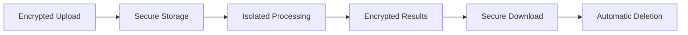

# Security

We take the security and privacy of your genetic data very seriously. This page outlines our comprehensive security measures and data protection policies.

## Data Security Overview

Our security framework is built on multiple layers of protection:

- **Encryption in transit and at rest**
- **Isolated processing environments**
- **Automatic data deletion**
- **Access control and monitoring**
- **Compliance with international standards**

## Data Transmission Security

### Encrypted Communication
- **TLS 1.3**: All data uploads use the latest Transport Layer Security
- **Certificate validation**: Verified SSL certificates for all endpoints
- **Perfect forward secrecy**: Session keys are not compromised if long-term keys are compromised

### Upload Security
```bash
# All uploads use HTTPS
curl -X POST https://imputationserver.com/api/upload \
     -H "Authorization: Bearer YOUR_TOKEN" \
     -F "file=@data.vcf" \
     --tlsv1.3
```

## Data Storage Security

### Encryption at Rest
- **AES-256 encryption**: All stored data encrypted with industry-standard algorithm
- **Key management**: Encryption keys managed through secure key management service
- **Storage isolation**: User data stored in isolated, encrypted volumes

### Access Controls
- **Role-based access**: Staff access limited by job function
- **Multi-factor authentication**: Required for all administrative access
- **Audit logging**: All data access logged and monitored

## Processing Environment

### Computational Security
- **Container isolation**: Each job runs in isolated Docker containers
- **Network segmentation**: Processing nodes isolated from external networks
- **Resource limits**: Containers have strict CPU and memory limits
- **Read-only filesystems**: Base images are immutable

### Data Flow Security


## Data Retention and Deletion

### Automatic Deletion Policy
- **7-day retention**: All user data automatically deleted after 7 days
- **Secure deletion**: Multi-pass deletion to prevent data recovery
- **Verification**: Deletion completion verified and logged

### Data Lifecycle
| Stage | Duration | Security Measures |
|-------|----------|-------------------|
| Upload | During transfer | TLS encryption |
| Processing | 1-24 hours | Isolated containers |
| Results | 7 days | Encrypted storage |
| Deletion | Immediate | Secure wiping |

## Privacy Protection

### Data Minimization
- **No permanent storage**: Data not retained beyond necessary period
- **Anonymized processing**: Personal identifiers removed during processing
- **Aggregated statistics only**: No individual-level data in system logs

### User Rights
- **Data access**: Users can request information about their processed data
- **Data deletion**: Users can request immediate data deletion
- **Processing transparency**: Clear information about data usage

## Compliance and Standards

### Regulatory Compliance
- **GDPR**: Full compliance with EU General Data Protection Regulation
- **HIPAA**: Healthcare data protection standards (for applicable data)
- **SOC 2**: Service Organization Control 2 certification
- **ISO 27001**: Information security management standards

### Security Audits
- **Regular penetration testing**: Third-party security assessments
- **Vulnerability scanning**: Continuous monitoring for security issues
- **Compliance audits**: Regular certification renewals

## Authentication and Authorization

### User Authentication
- **Secure passwords**: Strong password requirements
- **Two-factor authentication**: Optional 2FA for enhanced security
- **Session management**: Secure session handling with timeout

### API Security
```python
# API authentication example
import requests

headers = {
    'Authorization': 'Bearer YOUR_JWT_TOKEN',
    'Content-Type': 'application/json'
}

response = requests.get(
    'https://api.imputationserver.com/jobs',
    headers=headers
)
```

## Incident Response

### Security Monitoring
- **24/7 monitoring**: Continuous security monitoring and alerting
- **Intrusion detection**: Automated detection of suspicious activities
- **Log analysis**: Advanced analytics for threat detection

### Response Procedures
1. **Immediate containment**: Isolate affected systems
2. **Impact assessment**: Evaluate scope and severity
3. **User notification**: Inform affected users within 24 hours
4. **Remediation**: Implement fixes and security improvements

## Best Practices for Users

### Data Upload Security
- **Verify URLs**: Always check you're on the official website
- **Use strong passwords**: Create unique, complex passwords
- **Enable 2FA**: Use two-factor authentication when available
- **Check certificates**: Verify SSL certificate validity

### Data Preparation
- **Remove identifiers**: Strip personal identifiers before upload
- **Minimize data**: Upload only necessary genotype data
- **Document consent**: Ensure proper consent for data sharing

## Security Features by Component

### Web Interface
- **Content Security Policy**: Prevents cross-site scripting attacks
- **CSRF protection**: Guards against cross-site request forgery
- **Input validation**: All user inputs sanitized and validated
- **Rate limiting**: Prevents abuse and DoS attacks

### API Endpoints
- **JWT tokens**: Secure token-based authentication
- **Request signing**: Optional request signing for enhanced security
- **IP whitelisting**: Optional IP-based access restrictions
- **Rate limiting**: Per-user and per-endpoint limits

### Database Security
- **Encrypted connections**: All database connections encrypted
- **Access controls**: Database access restricted to authorized services
- **Audit trails**: All database operations logged
- **Backup encryption**: Database backups encrypted and secure

## Infrastructure Security

### Cloud Security
- **Private networks**: Processing in isolated virtual private clouds
- **Firewall rules**: Strict network access controls
- **DDoS protection**: Distributed denial-of-service mitigation
- **Geographic distribution**: Multi-region deployment for resilience

### Server Hardening
- **Minimal attack surface**: Only necessary services running
- **Regular updates**: Automated security patching
- **Configuration management**: Standardized, secure configurations
- **Intrusion prevention**: Host-based intrusion detection

## Reporting Security Issues

### Responsible Disclosure
If you discover a security vulnerability:

1. **Email us**: security@imputationserver.com
2. **Include details**: Description, reproduction steps, impact
3. **Allow time**: Give us 90 days to address before public disclosure
4. **Coordination**: Work with us on coordinated disclosure

### Security Contact
- **Email**: security@imputationserver.com
- **PGP Key**: Available on our contact page
- **Response time**: Within 24 hours for security issues

## Security Certifications

### Current Certifications
- **SOC 2 Type II**: Service organization controls
- **ISO 27001**: Information security management
- **CSA STAR**: Cloud security alliance certification

### Audit Reports
Annual security audit reports available upon request for institutional users.

## Frequently Asked Questions

### Is my data safe during processing?
Yes, your data is processed in isolated, encrypted environments with no external network access.

### Who can access my data?
Only automated systems access your data during processing. No human staff access individual datasets.

### How do I know my data is deleted?
You receive email confirmation when your data is permanently deleted from our systems.

### Can I request immediate deletion?
Yes, contact support to request immediate data deletion at any time.

## Updates and Changes

Security policies and procedures are regularly reviewed and updated. Users will be notified of significant changes to security practices.

**Last updated**: December 2024  
**Next review**: June 2025

For the most current security information, visit our [security page](https://imputationserver.com/security) or contact our security team. 