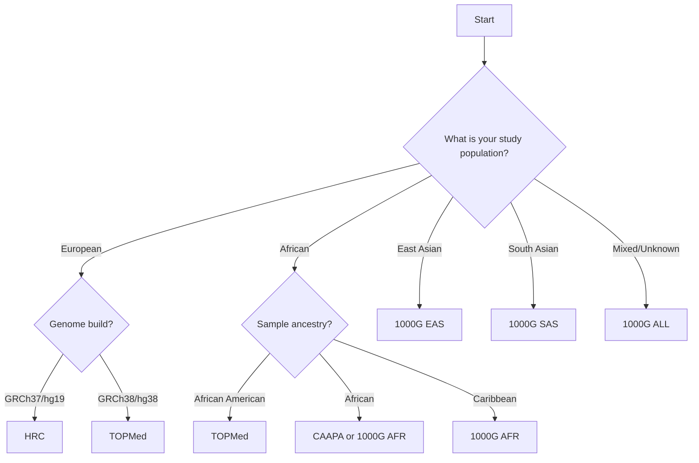

# Reference Panels

Reference panels are collections of phased haplotypes used for genotype imputation. This page describes reference panels and helps you choose the most appropriate one for your study.

::: warning Panel Availability
The specific reference panels available on the AfriGen-D Imputation Service may vary. Please check the [impute.afrigen-d.org](https://impute.afrigen-d.org) service interface for the current list of available panels. The panels described below represent commonly used reference panels in genotype imputation.
:::

## Choosing Reference Panels for African Populations

When working with African or African-diaspora populations, reference panel selection is particularly important due to Africa's high genetic diversity. Consider these factors:

- **Population Origin**: Match your study population to the reference panel ancestry
- **Sample Size**: Larger panels generally provide better imputation for rare variants
- **Genetic Diversity**: African populations have the highest genetic diversity worldwide
- **Admixture**: African American and diaspora populations may benefit from admixed panels

## Common Reference Panels

### 1000 Genomes Project Phase 3

**Overview:**
A global reference panel with diverse population representation, including substantial African diversity.

**Specifications:**

- **Samples**: 2,504 individuals from 26 populations
- **Variants**: 84,801,880 variants
- **Coverage**: Autosomes, chromosome X, chromosome Y
- **Genome Build**: GRCh37/hg19 and GRCh38/hg38
- **Populations**: Global diversity

**African Population Breakdown:**

| Population Code | Description | Sample Size | Region |
|----------------|-------------|-------------|--------|
| YRI | Yoruba in Ibadan, Nigeria | 108 | West Africa |
| LWK | Luhya in Webuye, Kenya | 99 | East Africa |
| GWD | Gambian in Western Divisions | 113 | West Africa |
| MSL | Mende in Sierra Leone | 85 | West Africa |
| ESN | Esan in Nigeria | 99 | West Africa |
| ASW | African Ancestry in Southwest US | 61 | African American |
| ACB | African Caribbean in Barbados | 96 | African Caribbean |

**Total African Samples**: 661 individuals

**Recommended For:**

- African and African-diaspora populations
- Chromosome X imputation
- Studies with diverse African ancestry
- When African-specific panels are not available

### Haplotype Reference Consortium (HRC)

**Overview:**
The HRC is the largest and most comprehensive reference panel for populations of European ancestry.

**Specifications:**
- **Samples**: 32,470 individuals
- **Variants**: 39,235,157 SNPs and indels
- **Coverage**: Autosomes only (chromosomes 1-22)
- **Genome Build**: GRCh37/hg19
- **Population**: Primarily European ancestry

**Strengths:**
- Highest imputation accuracy for European populations
- Large sample size for rare variant imputation
- Extensive quality control and validation
- Wide adoption in the research community

**Recommended For:**
- European ancestry populations
- High-density genotyping arrays
- Studies requiring maximum imputation accuracy

### 1000 Genomes Project Phase 3

**Overview:**
A global reference panel with diverse population representation.

**Specifications:**
- **Samples**: 2,504 individuals from 26 populations
- **Variants**: 84,801,880 variants
- **Coverage**: Autosomes, chromosome X, chromosome Y
- **Genome Build**: GRCh37/hg19 and GRCh38/hg38
- **Populations**: Global diversity

**Population Breakdown:**
| Super Population | Code | Samples | Sub-populations |
|------------------|------|---------|-----------------|
| European | EUR | 503 | CEU, TSI, FIN, GBR, IBS |
| African | AFR | 661 | YRI, LWK, GWD, MSL, ESN, ASW, ACB |
| East Asian | EAS | 504 | CHB, JPT, CHS, CDX, KHV |
| South Asian | SAS | 489 | GIH, PJL, BEB, STU, ITU |
| Admixed American | AMR | 347 | MXL, PUR, CLM, PEL |

**Recommended For:**
- Non-European populations
- Mixed ancestry studies
- Chromosome X imputation
- Studies with diverse populations

### TOPMed Freeze 5

**Overview:**
The Trans-Omics for Precision Medicine (TOPMed) program reference panel with deep sequencing data.

**Specifications:**
- **Samples**: 97,256 individuals
- **Variants**: 308,107,085 variants
- **Coverage**: Autosomes and chromosome X
- **Genome Build**: GRCh38/hg38
- **Sequencing**: Whole genome sequencing (30x coverage)

**Population Composition:**
- **African American**: ~53%
- **European**: ~31%
- **Hispanic/Latino**: ~11%
- **Asian**: ~4%
- **Other**: ~1%

**Recommended For:**
- Studies focusing on African ancestry
- Rare variant imputation
- Build 38 (hg38) studies
- High-resolution imputation needs

### CAAPA (Consortium on Asthma among African-ancestry Populations)

**Overview:**
Specialized reference panel for African ancestry populations.

**Specifications:**
- **Samples**: 5,405 individuals
- **Variants**: 31,163,897 variants
- **Coverage**: Autosomes only
- **Genome Build**: GRCh37/hg19
- **Population**: African ancestry

**Recommended For:**
- African and African-diaspora populations
- Studies with limited European admixture
- Asthma and respiratory disease research

## Choosing the Right Reference Panel

### Decision Matrix

Use this matrix to select the most appropriate reference panel:

### Population-Specific Recommendations

#### European Ancestry
1. **Primary choice**: HRC (GRCh37)
2. **Alternative**: 1000G EUR
3. **For hg38**: TOPMed (if sufficient European samples)

#### African Ancestry
1. **African American**: TOPMed
2. **Sub-Saharan African**: CAAPA or 1000G AFR
3. **Caribbean**: 1000G AFR

#### Asian Ancestry
1. **East Asian**: 1000G EAS
2. **South Asian**: 1000G SAS
3. **Mixed Asian**: 1000G ALL

#### Latino/Hispanic
1. **Primary choice**: 1000G AMR
2. **Alternative**: TOPMed (if high Native American ancestry)
3. **Highly admixed**: 1000G ALL

### Quality Metrics by Panel

| Panel | Common Variants (R²) | Low Freq Variants (R²) | Rare Variants (R²) |
|-------|---------------------|------------------------|-------------------|
| HRC | 0.95+ | 0.85+ | 0.70+ |
| 1000G | 0.90+ | 0.75+ | 0.50+ |
| TOPMed | 0.94+ | 0.88+ | 0.75+ |
| CAAPA | 0.92+ | 0.80+ | 0.65+ |

*R² values are approximate and depend on study population and genotyping platform*

## Panel Characteristics

### Variant Density

| Panel | Total Variants | SNPs | Indels | Multiallelic |
|-------|---------------|------|--------|--------------|
| HRC | 39.2M | 38.3M | 0.9M | 0.1M |
| 1000G | 84.8M | 77.7M | 6.6M | 0.5M |
| TOPMed | 308.1M | 261.9M | 45.2M | 1.0M |
| CAAPA | 31.2M | 30.1M | 1.0M | 0.1M |

### Frequency Spectra

**Common variants (MAF > 5%)**:
- HRC: ~8.5 million
- 1000G: ~12.3 million  
- TOPMed: ~15.2 million
- CAAPA: ~7.8 million

**Low frequency (1% < MAF ≤ 5%)**:
- HRC: ~12.1 million
- 1000G: ~18.7 million
- TOPMed: ~35.4 million  
- CAAPA: ~9.2 million

**Rare variants (MAF ≤ 1%)**:
- HRC: ~18.6 million
- 1000G: ~53.8 million
- TOPMed: ~257.5 million
- CAAPA: ~14.2 million

## Technical Details

### File Formats

All reference panels are provided in optimized formats:
- **Minimac3/4 format**: `.m3vcf` files for efficient imputation
- **VCF format**: Standard VCF 4.2 with phased genotypes
- **Indexed**: Tabix-indexed for fast random access

### Quality Control

Each panel undergoes extensive QC:
1. **Sample QC**: Relatedness, ancestry, contamination checks
2. **Variant QC**: Call rate, Hardy-Weinberg equilibrium, Mendelian errors
3. **Phasing QC**: Switch error rates, consistency checks
4. **Population stratification**: Principal component analysis

### Updates and Versioning

| Panel | Current Version | Last Updated | Next Update |
|-------|----------------|--------------|-------------|
| HRC | r1.1 | 2016 | No updates planned |
| 1000G | Phase 3 | 2014 | No updates planned |
| TOPMed | Freeze 5 | 2019 | Freeze 8 planned |
| CAAPA | v1.0 | 2016 | v2.0 in development |

## Performance Considerations

### Processing Time

Reference panel size affects processing time:

| Panel | Small Study (<1K) | Medium Study (10K) | Large Study (50K) |
|-------|-------------------|--------------------|--------------------|
| HRC | 1-2 hours | 4-6 hours | 12-16 hours |
| 1000G | 45-90 min | 3-4 hours | 8-12 hours |
| TOPMed | 2-3 hours | 6-8 hours | 16-24 hours |
| CAAPA | 45-90 min | 3-4 hours | 8-12 hours |

### Memory Requirements

| Panel | Minimum RAM | Recommended RAM |
|-------|-------------|-----------------|
| HRC | 32 GB | 64 GB |
| 1000G | 16 GB | 32 GB |
| TOPMed | 64 GB | 128 GB |
| CAAPA | 16 GB | 32 GB |

## Best Practices

### Panel Selection

1. **Match ancestry**: Choose panels with similar ancestry to your study
2. **Consider coverage**: Ensure adequate variant coverage for your analysis
3. **Build compatibility**: Match genome builds between data and panel
4. **Quality requirements**: Higher density panels for rare variant studies

### Multi-panel Strategies

For diverse studies, consider:
1. **Population-specific imputation**: Use different panels for different ancestry groups
2. **Meta-imputation**: Combine results from multiple panels
3. **Sensitivity analysis**: Compare results across panels

### Quality Assessment

After imputation, evaluate:
1. **Info scores**: Check imputation quality metrics
2. **Allele frequencies**: Compare with expected population frequencies
3. **Missingness patterns**: Identify systematically missing variants
4. **Population stratification**: Verify ancestry clustering

## Limitations and Considerations

### Known Limitations

1. **Population representation**: Some populations underrepresented
2. **Rare variants**: Lower accuracy for very rare variants
3. **Structural variants**: Limited coverage of complex variants
4. **Recombination**: Simplified recombination models

### Future Developments

Upcoming improvements include:
- **Larger sample sizes**: Next-generation panels with 100K+ samples
- **Better diversity**: Improved global population representation
- **Structural variants**: Integration of SV discovery
- **Pharmacogenomics**: Specialized panels for drug response

## Frequently Asked Questions

### Can I use multiple reference panels?

Currently, imputation uses one panel at a time. For population-specific analysis, we recommend matching panels to population ancestry.

### Which panel is most accurate?

Accuracy depends on your study population. HRC is most accurate for Europeans, while TOPMed excels for African ancestry studies.

### Do panels include chromosome X?

- **Include chrX**: 1000G, TOPMed
- **Autosomes only**: HRC, CAAPA

### Can I suggest new reference panels?

Yes! [Contact us](contact.md) with suggestions for additional panels. We regularly evaluate new resources for inclusion.

## Related Resources

- [Data preparation guidelines](genotype-imputation/data-preparation.md)
- [Pipeline overview](genotype-imputation/pipeline-overview.md)
- [Quality control best practices](genotype-imputation/faq.md#quality-control)
- [Population genetics resources](resources.md) 